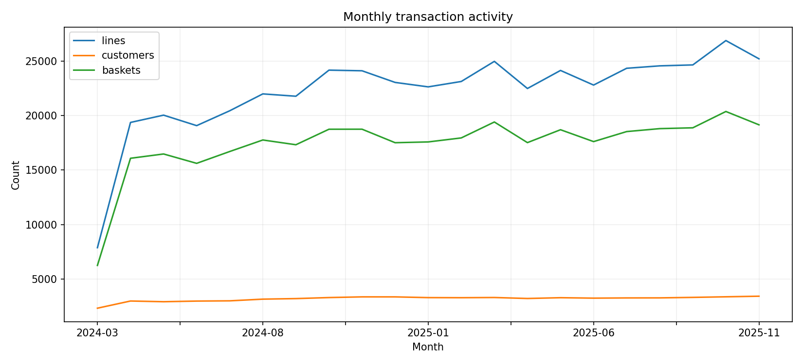
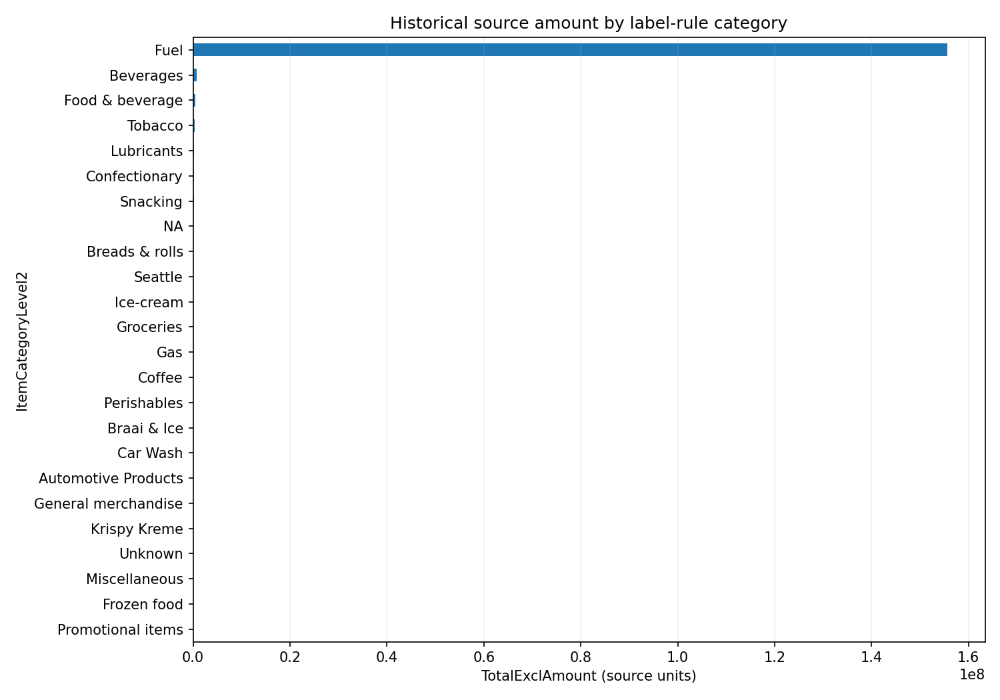
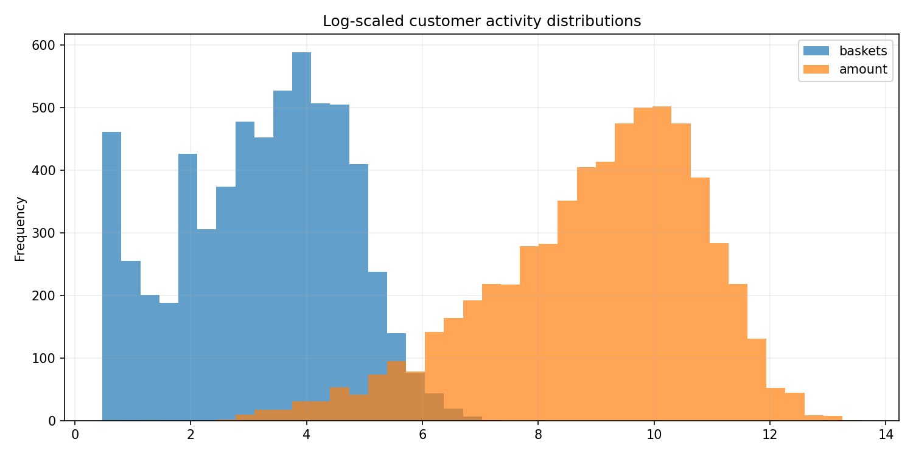
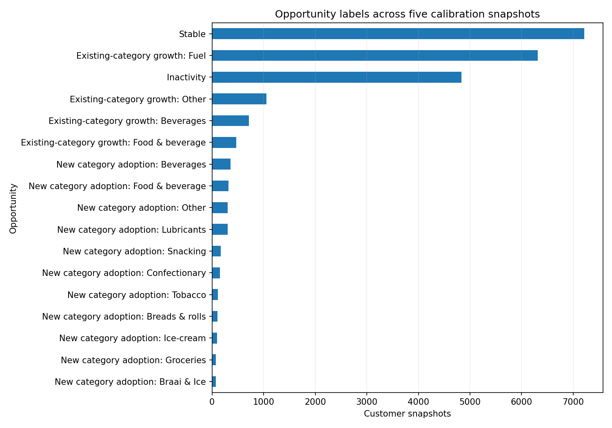
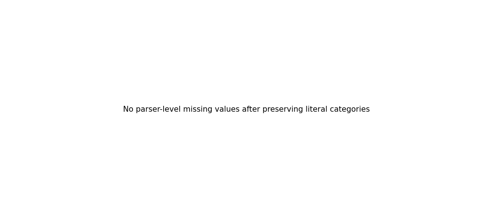

# EDA findings

- The release contains **467,880 line items**, **365,638 baskets**, **6,204 customers**, and **390 locations**.
- The history spans **2024-03-19 to 2025-11-30**; the latest complete history ends immediately before the 2025-12-01 test cutoff.
- The busiest month by source amount is **2025-10** (8,735,292 source units).
- Fuel is the dominant line-item category, so the model separates fuel litres from source monetary amounts and does not sum repeated basket totals.
- The five label snapshots generate **22,679 customer-snapshot rows**. The most frequent opportunity is **Stable**.
- Literal `NA` and `Unknown` categories are kept as real activity, while adjustment items and the three excluded categories are handled exactly according to the released rules.

